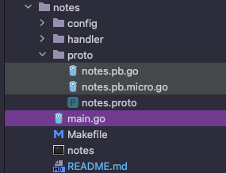

Store and retrieve notes

# Notes Service

The notes service lets you keep track of notes as first class objects. Subscribe to changes and
perform fast retrieval of all your notes.


## The proto compiler command
```shell
protoc --proto_path=. --micro_out=. --go_out=:. proto/notes.proto
```

## Understanding the go_package
n Protocol Buffers, the option go_package command is used to set the package name and location when the proto file gets 
created in Go.

Here is how to interpret this line:

```protobuf
option go_package = "./proto;notes";
```

- option sets a named option.
- go_package is unique to the Go language and affects how outputs from the protoc command get structured.
- The value of go_package is divided into two parts, separated by a semicolon (;).
- The part before the semicolon (./proto) is the path where the Go structs for this proto file will be generated. In 
this case, the protoc command will put the output files into a proto directory relative to the directory where the 
command was run.
- The part after the semicolon (notes) is the package name for your Go structs. So in your Go code, you would import 
this package using the given path and then refer to the types defined in the protobuf file as members of the notes 
package.
- Therefore, this line creates Go structs in the notes package under the ./proto directory.

## Directory structure


## Generate Go structs
```go
// Code generated by protoc-gen-go. DO NOT EDIT.
// versions:
// 	protoc-gen-go v1.36.2
// 	protoc        v5.29.3
// source: proto/notes.proto

package notes

import (
	protoreflect "google.golang.org/protobuf/reflect/protoreflect"
	protoimpl "google.golang.org/protobuf/runtime/protoimpl"
	reflect "reflect"
	sync "sync"
)

```