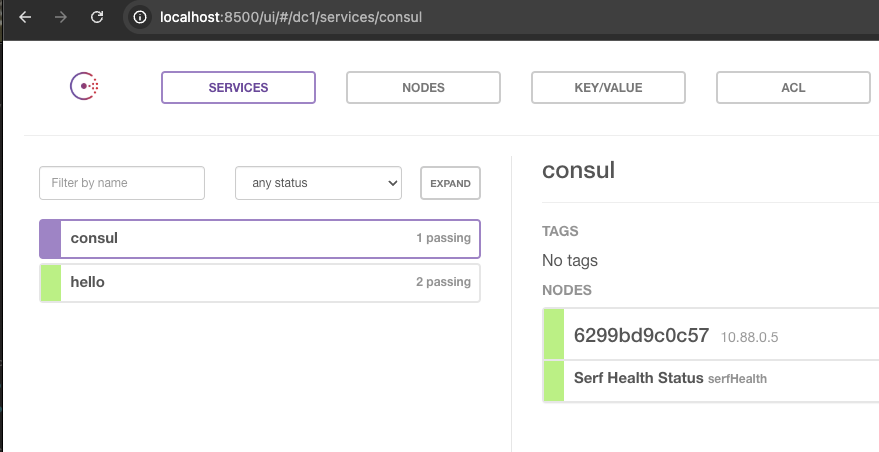

# Podman

## Install via brew
```shell
brew install podman
```

## Start podman
```shell
podman machine init
podman machine start
```

## Verify
```shell
podman info
```

## Run docker image
```shell
podman run hello-world
```

## Starting Consul server
```shell
podman run  -p 8500:8500 -p 8600:8600/udp --name=consul consul:v0.6.4 agent -server -bootstrap -ui -client=0.0.0.0
```
## Access the consul UI
http://localhost:8500/ui/#/dc1/services/consul



## References
- https://podman.io/docs/installation